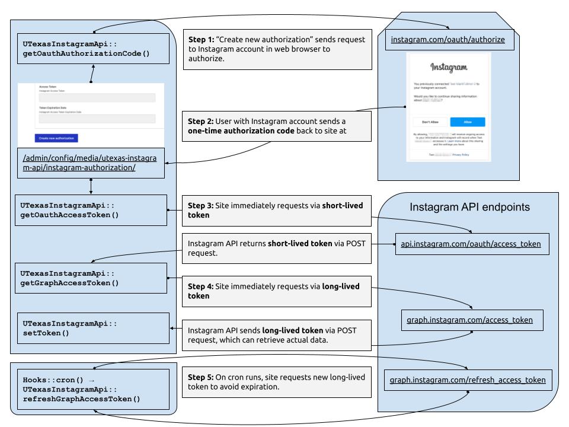

## UTexas Instagram API

This module provides the business logic for authorizing access and retrieving data from Instagram. The separate `utexas_instagram` module provides the block for displaying the content.

The main functionality of this, the `utexas_instagram_api` module, is to provide:

1. A Drupal configuration entity type, called "Instagram account authorization" which stores the Instagram account and credentials to pull data from. This is defined as a configuration entity so that sites can pull data from more than one Instagram account.
2. An implementation of Meta's OAuth protocol for performing an initial authorization. This process is described below.
3. An implementation of Meta's protocol for periodically refreshing the authorization token. Instagram authorization tokens are only valid for 60 days, so a cron process needs to run to get new tokens. This process is described below.

## The whole process for the end user
We describe the steps that an end user has to take to connect their Instagram account to the Drupal site in https://utexas.sharepoint.com/sites/UTDK/SitePages/instagram-setup.aspx . Part of that documentation involves setup outside of the Drupal site. The following documents what the code in `utexas_instagram_api` does to make the connection for the Drupal site.

## Performing the initial authorization, or "handshake"

This process is described in Meta documentation at https://developers.facebook.com/documentation/instagram-platform/overview . The below description illustrates how that process is connected in our code.

Relevant overview directly quoted from https://developers.facebook.com/documentation/instagram-platform/overview

> Before your app can use an endpoint to access an app user's Instagram professional account data, you must first request all permissions required by those endpoints from the app user. If you implement Business Login for Instagram, your app users log in with their Instagram credentials.

> To start the log in flow, an app user clicks your embed URL. Meta opens an authorization window where the user grants your app the requested permissions. Meta then redirects the user to your app's redirect URI and sends your app an Authorization Code. This code is valid for one hour.

Our business logic for retrieving the authorization code is in `UTexasInstagramApi::getOauthAuthorizationCode()`

> Next, exchange the authorization code for a short-lived access token, an ID for your app user, and a list of permissions granted by your app user. This access token is valid for one hour. Access tokens follow the OAuth 2.0 protocol, are app-scoped (unique to your app and app user), and required for most API calls. Apps using Business Login for Instagram receive Instagram User access tokens and apps using Facebook Login for Business receive Facebook User access tokens.

Our business logic for exchanging the code for a short-lived token is in `UTexasInstagramApi::getOauthAccessToken()`

> Before the short-lived access token expires, your app exchange it for a long-lived access token. This access token is valid for 60 days and can be refreshed before they expire.

Our business logic for exchanging the short-lived for the long-lived token is in `UTexasInstagramApi::getGraphAccessToken()`

## Performing periodic requests for a new token

Since long-lived access tokens last only 60 days, we need a recurring process to retrieve a fresh token. We use Drupal's built-in cron system for this (see `Drupal\utexas_instagram_api\Hook\Hooks::cron()`). This executes `UTexasInstagramApi::refreshGraphAccessToken()`:

## What are the most common issues we need to troubleshoot?
- Site owners who are trying to connect to Instagram often get thrown off by the complicated process. We document the steps at https://utexas.sharepoint.com/sites/UTDK/SitePages/instagram-setup.aspx , but it is still confusing and subject to periodic change without warning. In the past, we've met with people and walked through the steps together.
- Even though there is a recurring process to get a new, valid access token, occasionally sites' access tokens expire. When this happens, the simplest way to get things working again is to create a new Instagram authorization (`/admin/config/media/utexas-instagram-api/instagram-authorization`) using the credentials that were already setup up (i.e., start at Step 4 in https://utexas.sharepoint.com/sites/UTDK/SitePages/instagram-setup.aspx#step-4-connect-the-instagram-app-to-your-website), then delete the old integration, and finally go through all Instagram blocks on the site and update them to use the new integration.
- Periodically, Instagram changes its documentation and methodology. It would be a good idea to have a process, once or twice a year, that walks through the Instagram setup steps and confirms they are still valid and that the screenshots still reflect the current interface.
